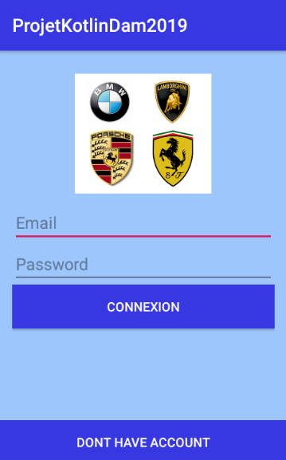
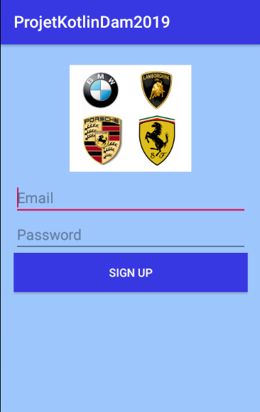
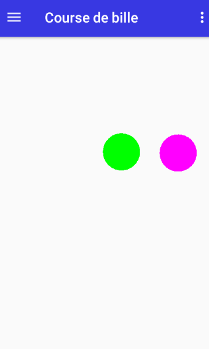
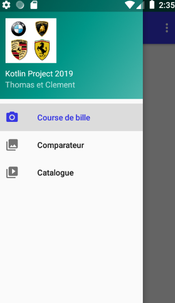
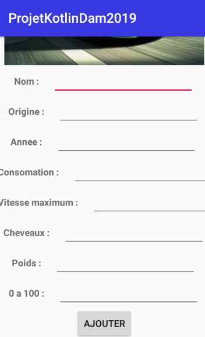
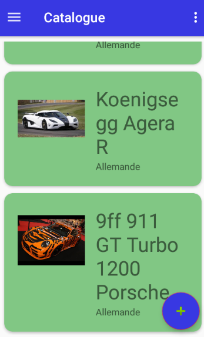
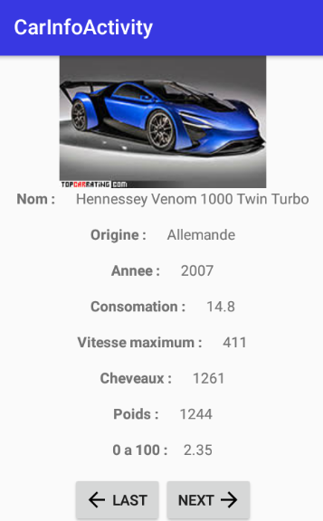

<h1 align="center">Welcome to (KotlinCarGallery)  👋</h1>
<p>
  
  <a href="https://github.com/kefranabg/readme-md-generator#readme" target="_blank">
    
  </a> 
</p>


## Présentation du projet
- Une application qui permet de voir les différentes choses vues en cours de programmation Android
- Une application qui permet d'approfondir les notions acquises pendant les cours de programmation Android
- Une application qui permet de gérer, ajouter, supprimer sa collection de voiture ainsi que de comparer les voitures de sa collection 

#### Technologies utilisées
- Android Studio
- Téléphone Android
- Firebase

#### A installer
- Git
- Android Studio

#### Télécharger le projet
- [Github](https://github.com/ThomasMetzger6898/ProjetKotlinDam2019)

#### Lancement du projet
nécessite [androidStudio](https://developer.android.com/studio/)
```sh
1)Lancer androidStudio
2)Ouvrir le projet
3)Brancher un téléphone ou télécharger un émulateur
4)Lancer l'application
```
### 🏠 [Capture D'écran]

#### Layout connexion

- Cette page permet de se connecter à l'application lorsque l'utilisateur à déjà un compte ou vient d'en créer un

#### Layout créer un compte

- Cette page permet de créer un compte lorsque l'utilisateur n'en a pas

#### Layout comparateur de voiture

- Cette page permet de selectionner deux voitures présentes dans la liste de voiture et de comparer leurs caractéristiques

#### Layout course de boules

- Cette page permet de créer autant de boules que l'on souhaite

#### Layout menu de navigation

- Cette navigation permet de naviger dans les pages de l'applications

#### Layout ajouter une voiture

- Cette page est lancée lorsque l'on appuie sur le float button en bas de la page Liste de voiture et permet de remplir les caractéristiques d'une nouvelles voitures

#### Layout liste de voiture

- Cette page permet de voir la liste de voiture de l'utilisateur.

 #### Layout detail de la voiture

- Cette page est lancée lorsque l'on clic sur un élément de la liste de voiture, on y retrouve les détails de la voiture sélectionné et l'on peut directement passer à la voiture suivante ou précédante de la liste.


## Auteurs
👤**Thomas Metzger**

👤**Clement Cipre**

## Readme auteurs 
👤**Jeremy Bazire**

👤**Jennifer Lobato Caldas**


## Montrez votre soutient

Donnez une ⭐️ si ce projet vous a aidé!

## 📝 License

Copyright © 2020 <br />
Ce projet est sous licence [MIT](https://github.com/kefranabg/readme-md-generator/blob/master/LICENSE) 

***
 _Ce README A été généré avec❤️_
