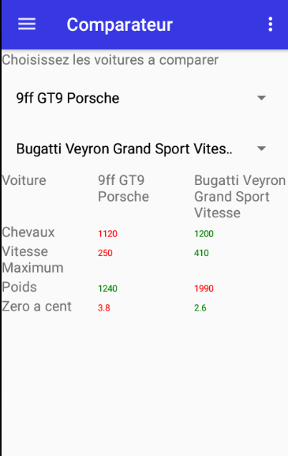

# Kotlin Car Gallery
Bienvenue dans KotlinCarGallery


## Présentation du projet
- Une application qui permet de voir les différentes choses vues en cours de programmation Android
- Une application qui permet d'approfondir les notions acquises pendant les cours de programmation Android
- Une application qui permet de gérer, ajouter, supprimer sa collection de voiture ainsi que de comparer les voitures de sa collection 

#### Technologies utilisées
- Android Studio, Téléphone Android, Firebase

#### A installer
- Git
- Android Studio

#### Télécharger le projet
- [Github](https://github.com/ThomasMetzger6898/ProjetKotlinDam2019)

#### Lancement du projet
nécessite [androidStudio](https://developer.android.com/studio/)
```sh
1)Lancer androidStudio
2)Ouvrir le projet
3)Brancher un téléphone ou télécharger un émulateur
4)Lancer l'application
```
#### Auteur du projet
- Thomas METZGER & Clement CIPRE 
#### Auteur du README
- Jeremy BLAZIRE & Jennifer LOBATO CALDAS

#### Layout connexion


#### Layout créer un compte


#### Layout comparateur de voiture


#### Layout course de boules


#### Layout menu de navigation


#### Layout ajouter une voiture


#### Layout liste de voiture


 #### Layout detail de la voiture

